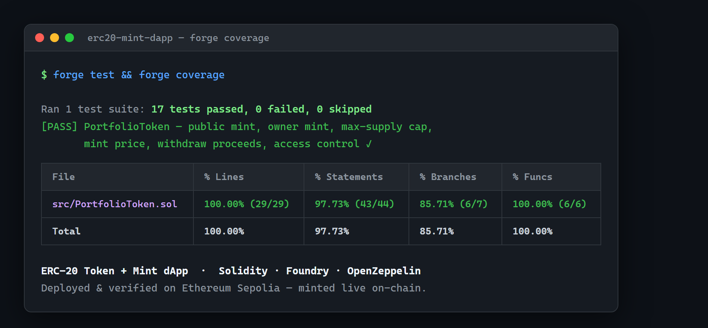
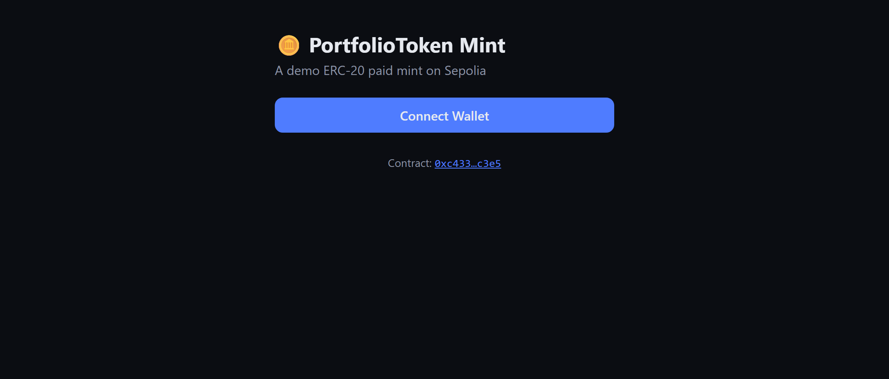

# PortfolioToken — ERC-20 with Paid Public Mint

A production-style ERC-20 token built with **Foundry** and **OpenZeppelin**, featuring a paid public mint, a capped supply, owner airdrops, and safe proceeds withdrawal. Fully tested (unit + fuzz) and deployed to **Ethereum Sepolia**.

> Portfolio project demonstrating smart-contract development, testing, and deployment workflow.

## 🟢 Live Deployment

| | |
|---|---|
| Network | Ethereum Sepolia (testnet) |
| Contract | [`0xc433a842b35f273dcc6f36138f09a649bb1cc3e5`](https://sepolia.etherscan.io/address/0xc433a842b35f273dcc6f36138f09a649bb1cc3e5) |

## Features

- **Capped supply** — hard maximum enforced on every mint path.
- **Paid public mint** — anyone can mint by paying `amount × mintPrice` (exact payment enforced).
- **Owner mint** — owner-only mint for airdrops / team allocation.
- **Adjustable price** — owner can update the mint price.
- **Safe withdrawal** — owner withdraws ETH proceeds via low-level call with success check.
- **Custom errors** — gas-efficient reverts with actionable context.
- **Events** — every state change is observable on-chain.

## Tech Stack

| Layer | Tool |
|-------|------|
| Language | Solidity ^0.8.20 |
| Framework | Foundry (forge / cast / anvil) |
| Libraries | OpenZeppelin Contracts v5 |
| Target chain | Ethereum Sepolia (testnet) |

## Project Structure

```
src/PortfolioToken.sol     # The token contract
test/PortfolioToken.t.sol  # 17 tests (unit + fuzz)
script/Deploy.s.sol        # Deployment script
frontend/                  # React + wagmi/viem mint dApp
```

## Quick Start

```bash
# Install dependencies
forge install

# Build
forge build

# Run tests
forge test -vv

# Gas report
forge test --gas-report

# Coverage
forge coverage
```

## Deployment (Ethereum Sepolia)

1. Get free testnet ETH from a [Sepolia faucet](https://www.alchemy.com/faucets/ethereum-sepolia).
2. Copy env file and fill in your **testnet-only** key:
   ```bash
   cp .env.example .env
   ```
3. Deploy and verify:
   ```bash
   source .env
   forge script script/Deploy.s.sol \
     --rpc-url $SEPOLIA_RPC_URL \
     --private-key $PRIVATE_KEY \
     --broadcast --verify \
     --etherscan-api-key $ETHERSCAN_API_KEY
   ```

## Frontend dApp

A minimal React + wagmi/viem dApp lives in `frontend/`. It connects an injected
wallet (MetaMask), reads live token stats, and lets users mint by paying ETH.

```bash
cd frontend
npm install
# After deploying, set the contract address:
echo "VITE_CONTRACT_ADDRESS=0xYourDeployedAddress" > .env
npm run dev
```

Stack: React 18, Vite, TypeScript, wagmi v2, viem v2, TanStack Query.

## Security Notes

- Exact-payment check prevents over/underpayment on mint.
- Supply cap checked before every `_mint`.
- Withdrawal uses checked low-level call and reverts on failure.
- `Ownable` guards all admin functions.
- ⚠️ This is an educational/portfolio contract — not professionally audited. Do not use in production with real value without an audit.

## License

MIT

## Screenshots

| Test coverage | dApp UI |
|---|---|
|  |  |
